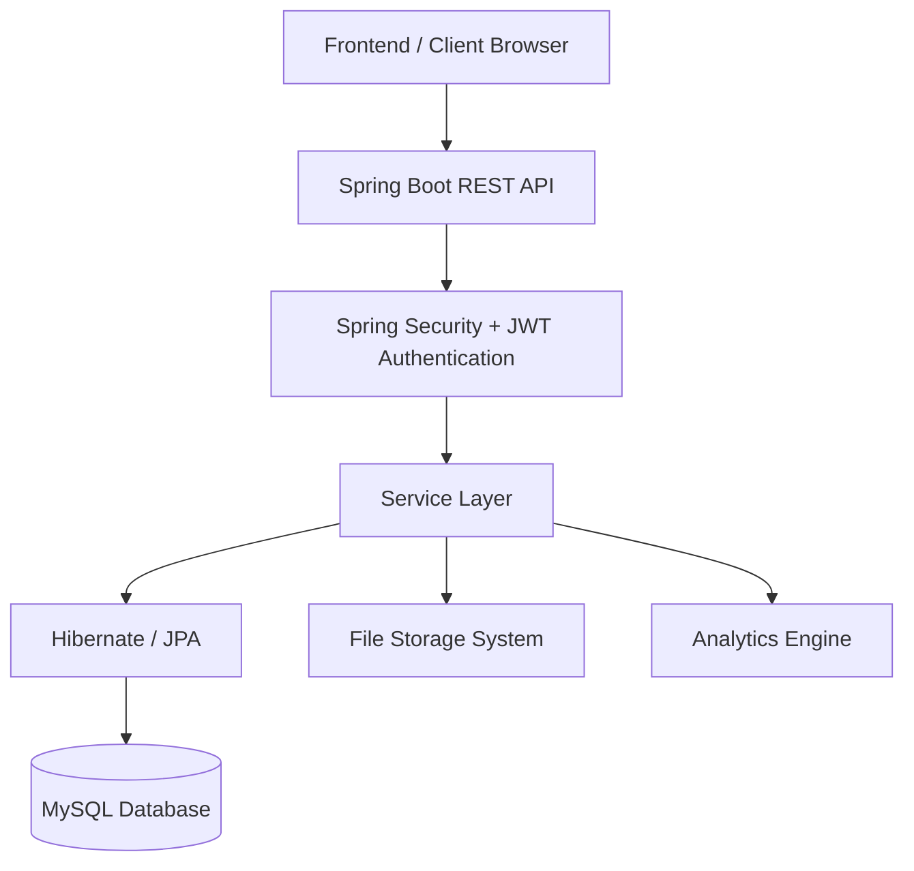
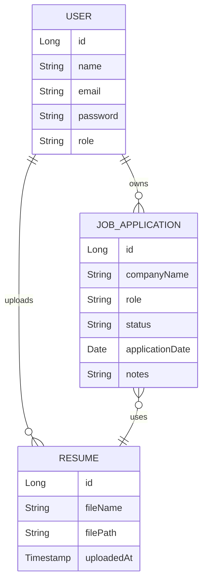

# Job Application Tracker

A full-stack enterprise-style web application designed to help job seekers efficiently manage and track their job applications throughout the hiring lifecycle.

Built with Java, Spring Boot, Spring Security, JWT Authentication, MySQL, Hibernate/JPA, and modern web technologies, this project demonstrates production-oriented backend engineering practices including authentication, role-based access control, REST API design, secure file handling, relational database modeling, and scalable application architecture.

---

## Live Overview

The Smart Job Application Tracker enables users to:

- Register and securely log in
- Track all job applications in one place
- Manage application stages
- Upload and manage multiple resume versions
- Add interview/job notes
- Track statuses like Applied, Interview, Offer, Rejected
- Search and filter job applications
- View dashboard analytics
- Manage user-specific data securely

This project simulates a real-world SaaS product for job seekers.

---

## Project Preview


# Architecture

## High-Level System Architecture



---

## Backend Architecture Pattern

This project follows a layered architecture:

```text
Controller Layer
    ↓
Service Layer
    ↓
Repository Layer
    ↓
Database Layer
```

### Controller Layer
Handles:

- HTTP requests
- Request validation
- API routing
- Response handling

### Service Layer
Contains:

- Business logic
- Application workflow management
- Resume handling logic
- Analytics computation
- Authentication workflows

### Repository Layer
Responsible for:

- Database access
- CRUD operations
- Entity persistence
- Query abstraction

---

# Tech Stack

## Backend

- Java 17+
- Spring Boot
- Spring MVC
- Spring Security
- JWT Authentication
- Hibernate ORM
- JPA
- Maven

## Database

- MySQL

## Frontend

- HTML
- CSS
- JavaScript
- Thymeleaf *(if server-rendered UI is used)*

## File Handling

- Multipart File Upload
- Secure Resume Storage

## Security

- BCrypt Password Hashing
- JWT Token Authentication
- Protected API Endpoints
- Session-safe Authorization

## Tools

- Git
- GitHub
- Postman
- IntelliJ IDEA / VS Code
- Maven

---

# Key Features

## Authentication & Authorization

Secure user authentication system with:

- User registration
- User login
- JWT token generation
- Token validation
- Password encryption
- Protected endpoints
- Role-based authorization

---

## Job Application Management

Users can:

- Add new job applications
- Edit applications
- Delete applications
- View application details
- Track company name
- Store job role
- Save application links
- Track dates

---

## Application Status Tracking

Track the full hiring lifecycle:

- Applied
- Online Assessment
- Shortlisted
- Interview Scheduled
- Rejected
- Offer Received
- Accepted

---

## Resume Management

Built-in resume version management:

- Upload resume files
- Store multiple resume versions
- View uploaded resumes
- Delete outdated resumes
- Associate resumes with applications

Demonstrates:

- File upload handling
- Storage management
- Backend file serving
- Secure document access

---

## Notes Management

Users can add:

- Interview notes
- Recruiter follow-up notes
- Preparation reminders
- Personal comments

---

## Search & Filtering

Improves usability with:

- Search by company
- Search by role
- Filter by application status
- Quick record access

---

## Dashboard Analytics

Provides useful hiring insights:

- Total applications count
- Status-wise breakdown
- Progress monitoring
- Job hunt analytics

---

# Database Design

## Core Entities

### User

Stores:

- User ID
- Name
- Email
- Password
- Role
- Account metadata

---

### Job Application

Stores:

- Application ID
- Company Name
- Job Role
- Status
- Application Date
- Notes
- Resume reference
- User association

---

### Resume

Stores:

- Resume ID
- File name
- File path
- Upload timestamp
- Owner reference

---

## Entity Relationship Diagram



---

# API Overview

## Authentication APIs

```http
POST /api/auth/register
POST /api/auth/login
```

---

## Job Application APIs

```http
GET    /api/applications
GET    /api/applications/{id}
POST   /api/applications
PUT    /api/applications/{id}
DELETE /api/applications/{id}
```

---

## Resume APIs

```http
POST   /api/resumes/upload
GET    /api/resumes
GET    /api/resumes/view/{filename}
DELETE /api/resumes/{id}
```

---

## Dashboard APIs

```http
GET /api/dashboard/analytics
```

---

# Security Implementation

This project demonstrates practical backend security implementation:

### Password Security

- BCrypt hashing
- Secure credential storage

### JWT Security

- Stateless authentication
- Signed tokens
- Request validation filters

### Authorization

- Protected endpoints
- User-specific data isolation
- Role-based access checks

---

# Project Structure

```text
Job-Application-Tracker/
│
├── src/main/java/com/hruthvik/
│   ├── controller/
│   ├── service/
│   ├── repository/
│   ├── model/
│   ├── dto/
│   ├── security/
│   ├── config/
│   └── exception/
│
├── src/main/resources/
│   ├── templates/
│   ├── static/
│   ├── application.properties
│
├── uploads/
├── pom.xml
└── README.md
```

---

# Installation & Setup

## Prerequisites

Install:

- Java 17+
- Maven
- MySQL
- Git

---

## Clone Repository

```bash
git clone https://github.com/hruthvikkm6/Job-Application-Tracker.git
cd Job-Application-Tracker
```

---

## Configure Database

Update:

```properties
src/main/resources/application.properties
```

Example:

```properties
spring.datasource.url=jdbc:mysql://localhost:3306/job_tracker
spring.datasource.username=your_username
spring.datasource.password=your_password
```

---

## Build Project

```bash
mvn clean install
```

---

## Run Application

```bash
mvn spring-boot:run
```

Application runs at:

```bash
http://localhost:8080
```

---

# Engineering Concepts Demonstrated

This project highlights:

- Enterprise Java backend development
- REST API architecture
- Secure authentication systems
- JWT implementation
- Spring Security
- ORM with Hibernate
- Relational database modeling
- File upload/storage systems
- MVC architecture
- Exception handling
- DTO usage
- Service layer abstraction
- Production-style code organization

---

# Challenges Solved

Key engineering challenges tackled:

- Designing secure authentication workflows
- Implementing JWT-based stateless auth
- Managing relational entity mappings
- Secure resume file upload handling
- Protecting user-specific resources
- Building scalable layered architecture
- Implementing dashboard analytics logic

---

# Future Improvements

Potential enhancements:

- Email reminders for follow-ups
- Resume parsing using AI
- Interview scheduling calendar
- Recruiter contact management
- Export application reports
- Docker containerization
- Cloud deployment (AWS / Render / Railway)
- Redis caching
- Admin dashboard
- Notification system

---

# Why This Project Matters

This is not just a CRUD project.

It demonstrates:

✅ Authentication & Authorization  
✅ Secure backend engineering  
✅ File handling  
✅ Database design  
✅ Real-world business logic  
✅ Scalable architecture  
✅ Recruiter-relevant problem solving

This project closely reflects production backend application development.

---

# Author

## Hruthvik K M

Java Backend Developer | Spring Boot Enthusiast | Software Engineering Learner

GitHub: https://github.com/hruthvikkm6  
LinkedIn: https://www.linkedin.com/in/hruthvikkm/  
Project Repository: https://github.com/hruthvikkm6/Job-Application-Tracker

---

# License

This project is created for educational, portfolio, and demonstration purposes.

---

# Connect

If you'd like to discuss backend engineering, Java development, or collaboration opportunities:

GitHub: https://github.com/hruthvikkm6  
LinkedIn: https://www.linkedin.com/in/hruthvikkm/
